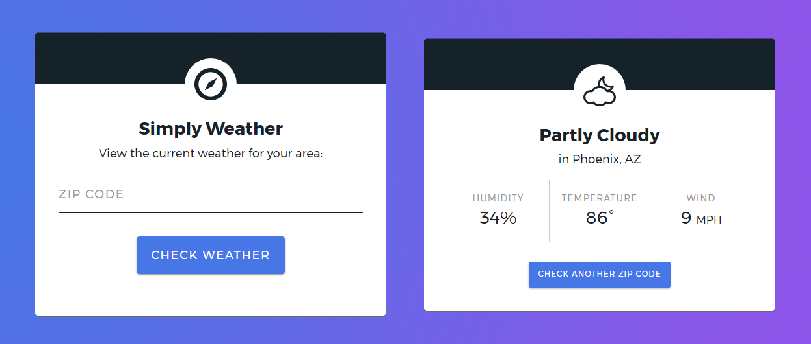

# Simply Weather
A simple [Serverless](https://serverless.com/) web app that displays the current weather based on the user's zip code.

## Directories
There are two main directories: `serverless`, which houses the code for the Lambda function that powers the web app, and `user-interface`, which houses the code for the user interface of the web app.

## API Integrations
Simply Weather is powered by the [Dark Sky](https://darksky.net/dev) weather API and the [ZipCodeAPI](https://www.zipcodeapi.com/). API calls are limited to 40 per hour using the [Node Rate Limiter](https://github.com/jhurliman/node-rate-limiter) module.

## Additional Notes
Please note that the API keys and AWS url have been scrubbed.